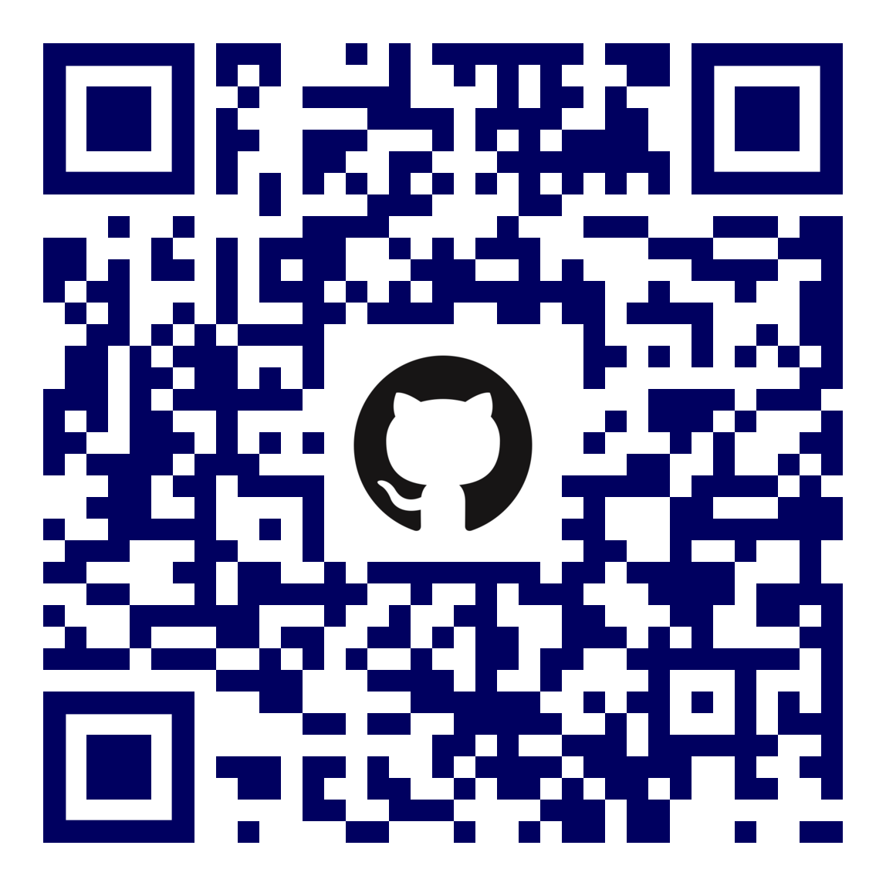

= Software Engineer
Matteo Franci

[.info]
== !

image:resources/photo.jpg[role=profil]

=== Matteo Franci

[contact]
:hide-uri-scheme:
- image:resources/location.png[role="picto"] Roma, Italia
//- image:resources/phone.svg[role="picto phone"] +39 ...
- image:resources/mail.svg[role="picto"] m@fugerit.org
- image:resources/github.png[role="picto"] https://github.com/fugerit79
- image:resources/www.svg[role="picto"] https://www.fugerit.org
- image:resources/linkedIn.png[role="picto"] https://www.linkedin.com/in/matteo-franci/[in/matteo-franci]

=== !
[atouts]
* Problem-solving
* Autonomia
* Condivisione

==== Competenze
[infosect]
* Analisi scenari complessi
* Sviluppo software
* Revisione software (Qualità e sicurezza)
* Automazione (CI/CD)
* Linux/MacOS/Windows
* Tuning performance e alta affidabilità

==== Caratteristiche

* Curiosità
* Precisione
* Entusiasmo

==== Lingue

- Inglese (Buono)
- Russo (Buono)

==== Interessi

- Open Source
- Tecnologia

[.version]
==== Versione 1.2.0 (2025-03-06)

[role=qrcode-info]
(Creato con AsciiDoc, scansiona il QR Code per aprire il repository GitHub)

[.chronologie]
== !

=== Profilo Professionale

Software Engineer con oltre 20 anni di esperienza nello sviluppo software per la PA e contributor attivo a progetti Open Source. Specializzato in Java, CI/CD, Docs-as-Code e sistemi cloud-native. Appassionato di tecnologia e con una forte propensione alla condivisione della conoscenza e al supporto dei team nell’adozione di pratiche DevOps. Credo nell'adozione di best practice — testing, secure coding, DevOps — e di azioni concrete per aumentare la stabilità e la sicurezza dei sistemi. Promuovo attivamente l'automazione per ridurre il tempo di sviluppo e migliorare la qualità complessiva.

=== Esperienze lavorative
[.heading]

==== 2007 - in corso
*Sogei S.p.A.*

[cols="1,1,2,4"]
|===
| Inizio | Fine | Ruolo | Progetto

| 2022
| in corso
| Software Engineer e Release Manager (*)
| link:https://github.com/italia/ansc[A.N.S.C.] - Archivio Nazionale informatizzato dei registri dello Stato Civile

| 2016
| in corso
| Software Engineer e Release Manager (*)
| link:https://github.com/italia/anpr[A.N.P.R.] - Anagrafe Nazionale Della Popolazione Residente

| 2013
| 2016
| Software Engineer
| Sistema di monitoraggio dello stato di pagamento delle cartelle Equitalia

| 2010
| 2016
| Software Engineer
| link:https://www.agenziaentrateriscossione.gov.it/it/i-servizi-di-ader-a-portata-di-click/parte-seconda-quali-sono-i-servizi-di-ader/richiedere-documenti-o-informazioni-su-pagamenti-e-procedure/[Servizi per cittadini e professiosti Agenzia delle entrate Riscossione] (ex Equitalia)

| 2008
| 2010
| Software Engineer
| link:https://sistemats1.sanita.finanze.it/[Sistema Tessera Sanitaria]

| 2007
| 2008
| Software Engineer
| SECIN - Monitoraggio degli obiettivi strategici dell'amministrazione
finanziaria.

|===

(*) In questo ruolo mi sono occupato in particolare di :

* Configurazione e manutenzione CI (pipeline Azure DevOps)
* Coordinamento team di sviluppo
* Change Management
* Sviluppo software
* Documentazione (in particolare docs as code)

==== 2004 - 2007
*OpenInformatica S.R.L.*

[cols="1,1,2,4"]
|===
| Inizio | Fine | Ruolo | Progetto

| 2004
| 2007
| Software Engineer
| Consulenze per molti progetti in ambito privato e pubblico

|===

=== Alcuni progetti
[.heading]

==== Open Source

* Contribuzioni a repository Open Source quali
link:https://github.com/snakeyaml/snakeyaml/commits?author=fugerit79[SnakeYAML]
link:https://github.com/smallrye/smallrye-config/commits?author=fugerit79[SmallRye config]
link:https://github.com/oracle/graalvm-reachability-metadata/commits?author=fugerit79[GraalVM Reachability Metadata]
link:https://github.com/apache/camel-quarkus/commits?author=fugerit79[Camel Quarkus]
link:https://github.com/quarkusio/quarkus/commits?author=fugerit79[Quarkus]
link:https://github.com/xmlet/XsdParser/commits?author=fugerit79[XsdParser]
link:https://github.com/italia/cie-cns-apache-docker?author=fugerit79[cie-cns-apache-docker].

* link:https://venusdocs.fugerit.org/[Venus - Fugerit Document Generation Framework (fj-doc)], permette di produrre documenti in differenti formati di output (HTML, PDF, CSV, XLSX, AsciiDoc) a partire da un modello sorgente XML (in alternativa è possibile usare JSON, YAML o Kotlin come sorgente). E' disponibile anche un link:https://docs.fugerit.org/fj-doc-playground/home/[Playground online].

* link:https://graalkus.fugerit.org/[Graalkus - Let Quarkus fly high with GraalVM], microservizio didattico basato su link:https://www.graalvm.org/[GraalVM], link:https://quarkus.io/[Quarkus], JAVA. Integrato con link:https://docs.github.com/en/actions[GitHub Actions] per la CI, OpenShift link:https://developers.redhat.com/developer-sandbox[Developer Sandbox] o link:https://www.docker.com/[Docker/Podman] come ambiente di deploy. Corredato di documentazione link:https://asciidoc.org/[AsciiDoc] e presentazione link:https://sli.dev/[Slidev]. (E' un esempio completo di buone pratiche applicate allo sviluppo software, Quality gate, Testing etc).

* Utility e librerie pubblicati in due organizzazioni link:https://github.com/fugerit-org[Fugerit Org] e link:https://github.com/caffetteria[Caffetteria].

==== Professionali

* Repository GitHub Anagrafe Nazionale (ANPR) - https://github.com/italia/anpr
* Repository GitHub Stato Civile (ANSC) - https://github.com/italia/ansc
* Servizi di Anagrafe e Stato Civile - https://www.anagrafenazionale.interno.it/

=== Educazione
[.heading]

==== 1997 : Diploma maturità scientifica (60/60)
Liceo Scientifico J.F. Kennedy, Via N. Fabrizi, 7 Roma
